# 開發者都應該知道的12個架構

## 專案簡介

本專案以 **Kind (Kubernetes in Docker)** 為基礎，提供 **12 個架構概念**的實作練習。每個概念都有獨立的 PoC（概念驗證），讓你可以親手操作、觀察結果，深入理解這些在大型分散式系統中不可或缺的設計模式。

這些概念來自 [ByteByteGo](https://bytebytego.com/) 的系統設計教學，適合：
- 想了解後端架構的初學者
- 準備系統設計面試的工程師
- 想在本地環境練習 Kubernetes 的開發者

---

## 目錄

1. [為什麼要學習這些概念？](#為什麼要學習這些概念)
2. [環境準備](#環境準備)
3. [快速開始](#快速開始)
4. [12 個架構概念總覽](#12-個架構概念總覽)
5. [詳細教學](#詳細教學)
   - [概念 0：叢集建置](#概念-0叢集建置)
   - [概念 1：負載平衡 (Load Balancing)](#概念-1負載平衡-load-balancing)
   - [概念 2：快取 (Caching)](#概念-2快取-caching)
   - [概念 3：內容傳遞網路 (CDN)](#概念-3內容傳遞網路-cdn)
   - [概念 4：訊息佇列 (Message Queue)](#概念-4訊息佇列-message-queue)
   - [概念 5：發布/訂閱 (Publish-Subscribe)](#概念-5發布訂閱-publish-subscribe)
   - [概念 6：API 閘道 (API Gateway)](#概念-6api-閘道-api-gateway)
   - [概念 7：斷路器 (Circuit Breaker)](#概念-7斷路器-circuit-breaker)
   - [概念 8：服務發現 (Service Discovery)](#概念-8服務發現-service-discovery)
   - [概念 9：分片 (Sharding)](#概念-9分片-sharding)
   - [概念 10：限流 (Rate Limiting)](#概念-10限流-rate-limiting)
   - [概念 11：一致性雜湊 (Consistent Hashing)](#概念-11一致性雜湊-consistent-hashing)
   - [概念 12：自動擴縮 (Auto Scaling)](#概念-12自動擴縮-auto-scaling)
6. [學習路徑建議](#學習路徑建議)
7. [常見問題排解](#常見問題排解)
8. [延伸學習資源](#延伸學習資源)

---

## 為什麼要學習這些概念？

在現代軟體開發中，單一伺服器已無法應付大量用戶的需求。當你的應用需要服務百萬甚至上億用戶時，你必須了解如何：

| 挑戰 | 對應的架構概念 |
|------|---------------|
| 單一伺服器撐不住流量 | **負載平衡**、**自動擴縮** |
| 資料庫查詢太慢 | **快取**、**分片** |
| 靜態資源載入慢 | **CDN** |
| 服務之間耦合太緊 | **訊息佇列**、**發布/訂閱** |
| 單一服務故障影響全局 | **斷路器** |
| API 管理混亂 | **API 閘道**、**限流** |
| 服務位址動態變化 | **服務發現** |
| 資料分佈不均勻 | **一致性雜湊** |

學會這些概念，你就能設計出**高可用性**、**高效能**、**可擴展**的系統架構。

---

## 環境準備

### 必要工具

| 工具 | 最低版本 | 用途 | 安裝指令 (macOS) |
|------|---------|------|-----------------|
| Docker | 24+ | 容器運行環境 | [下載 Docker Desktop](https://docs.docker.com/get-docker/) |
| Kind | 0.20+ | 本地 Kubernetes 叢集 | `brew install kind` |
| kubectl | 1.28+ | Kubernetes 命令列工具 | `brew install kubectl` |
| Helm | 3.12+ | Kubernetes 套件管理器 | `brew install helm` |
| jq | 任意版本 | JSON 格式化工具 | `brew install jq` |

### 驗證安裝

```bash
# 檢查所有工具是否安裝成功
docker --version      # Docker version 24.x.x
kind --version        # kind v0.20.x
kubectl version --client  # Client Version: v1.28.x
helm version          # version.BuildInfo{Version:"v3.12.x"...}
jq --version          # jq-1.x
```

### 系統需求

- **記憶體**: 建議 8GB 以上（Kind 叢集會佔用約 4GB）
- **硬碟空間**: 至少 20GB 可用空間（Docker 映像檔會佔用較多空間）
- **作業系統**: macOS、Linux、Windows (with WSL2)

---

## 快速開始

```bash
# 1. 複製專案
git clone https://github.com/ChunPingWang/12-architecture-concepts.git
cd 12-architecture-concepts

# 2. 建立 Kubernetes 叢集（約需 2-3 分鐘）
./scripts/00-setup-cluster.sh

# 3. 逐一執行各 PoC
./scripts/01-load-balancing.sh
./scripts/02-caching.sh
# ... 以此類推

# 4. 清理環境
./scripts/cleanup.sh
# 或完全刪除叢集
kind delete cluster --name arch-poc
```

---

## 12 個架構概念總覽

### 架構概念關係圖

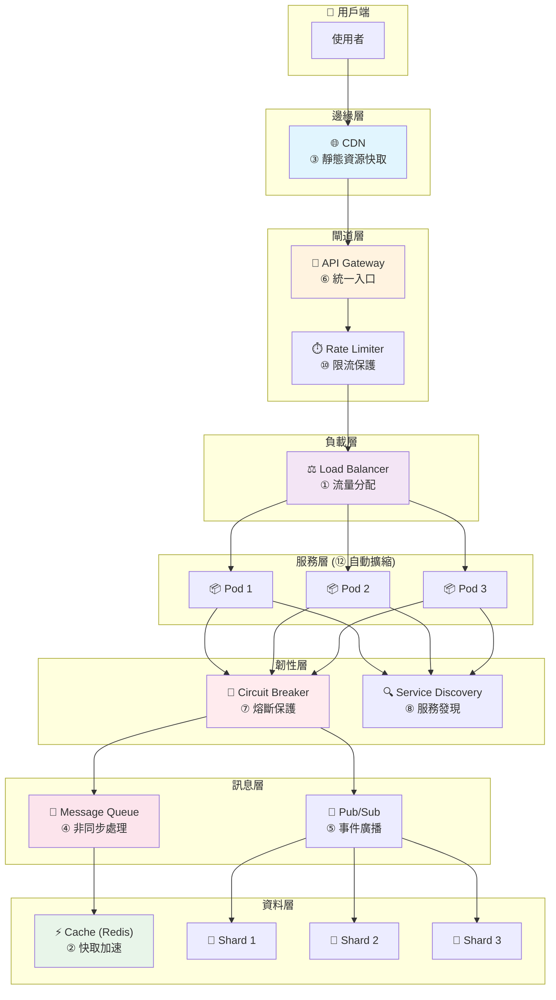

> **圖例說明**：① ~ ⑫ 代表本專案的 12 個 PoC 概念編號，資料層的 Shard 使用 ⑨ 分片 + ⑪ 一致性雜湊

### 概念速查表

| # | 概念 | 一句話解釋 | 使用元件 | 難度 |
|---|------|----------|---------|------|
| 1 | 負載平衡 | 把流量平均分給多台伺服器 | NGINX Ingress | ⭐ |
| 2 | 快取 | 把常用資料存在記憶體，加速存取 | Redis | ⭐ |
| 3 | CDN | 把靜態檔案放在離用戶近的地方 | MinIO + NGINX | ⭐⭐ |
| 4 | 訊息佇列 | 讓服務之間非同步溝通 | RabbitMQ | ⭐⭐ |
| 5 | 發布/訂閱 | 一則訊息廣播給所有訂閱者 | Apache Kafka | ⭐⭐⭐ |
| 6 | API 閘道 | 所有 API 的統一入口 | Apache APISIX | ⭐⭐ |
| 7 | 斷路器 | 服務故障時自動熔斷，避免雪崩 | Python / Resilience4j / Polly | ⭐⭐⭐ |
| 8 | 服務發現 | 讓服務自動找到彼此 | Kubernetes DNS | ⭐ |
| 9 | 分片 | 把資料分散到多個資料庫 | CockroachDB | ⭐⭐⭐ |
| 10 | 限流 | 限制每秒請求數，保護後端 | NGINX Ingress | ⭐ |
| 11 | 一致性雜湊 | 資料均勻分佈，減少重新分配 | Hazelcast | ⭐⭐⭐ |
| 12 | 自動擴縮 | 根據負載自動增減伺服器 | K8s HPA | ⭐⭐ |

---

## 詳細教學

### 概念 0：叢集建置

**目的**：建立一個多節點的 Kubernetes 叢集作為實驗環境。

**你會學到**：
- Kind 如何在 Docker 中運行 Kubernetes
- Kubernetes 叢集的基本組成（control-plane、worker nodes）
- metrics-server 和 Ingress Controller 的作用

**執行**：
```bash
./scripts/00-setup-cluster.sh
```

**驗證**：
```bash
# 查看叢集節點
kubectl get nodes

# 預期輸出：1 個 control-plane + 3 個 worker
NAME                     STATUS   ROLES           AGE   VERSION
arch-poc-control-plane   Ready    control-plane   5m    v1.35.0
arch-poc-worker          Ready    <none>          5m    v1.35.0
arch-poc-worker2         Ready    <none>          5m    v1.35.0
arch-poc-worker3         Ready    <none>          5m    v1.35.0
```

**背景知識**：
- **Control Plane**：叢集的「大腦」，負責調度、管理所有工作節點
- **Worker Node**：實際運行應用程式 Pod 的節點
- **metrics-server**：收集 CPU/記憶體指標，供 HPA 使用
- **Ingress Controller**：管理外部流量進入叢集的入口

---

### 概念 1：負載平衡 (Load Balancing)

#### 什麼是負載平衡？

想像你開了一家餐廳，只有一個服務生。當客人變多時，這個服務生會忙不過來。
**負載平衡**就像多請幾個服務生，把客人平均分配給他們服務。

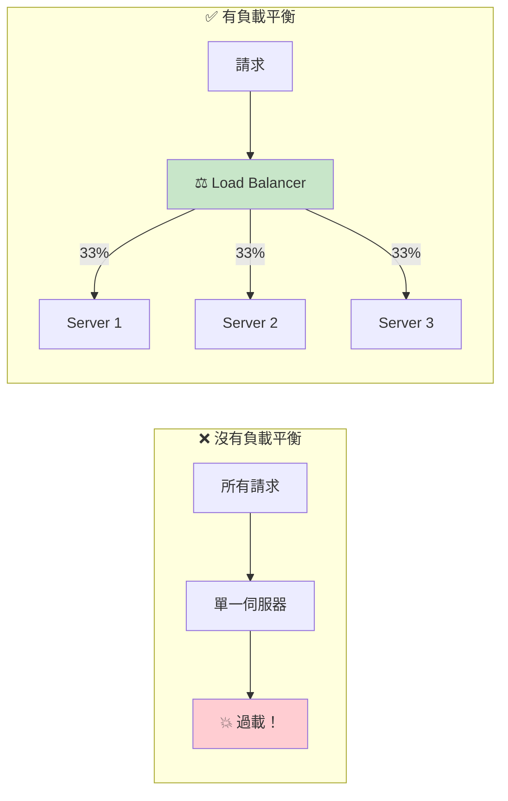

#### 負載平衡演算法

| 演算法 | 說明 | 適用場景 |
|--------|------|---------|
| **Round Robin** | 輪流分配，每個伺服器依序處理請求 | 伺服器效能相同 |
| **Weighted Round Robin** | 按權重分配，效能好的伺服器處理更多請求 | 伺服器效能不同 |
| **Least Connections** | 分給目前連線數最少的伺服器 | 長連線場景（如 WebSocket） |
| **IP Hash** | 同一 IP 的請求固定到同一伺服器 | 需要 Session 黏著 |
| **Random** | 隨機選擇伺服器 | 簡單場景 |

#### 負載平衡演算法流程圖

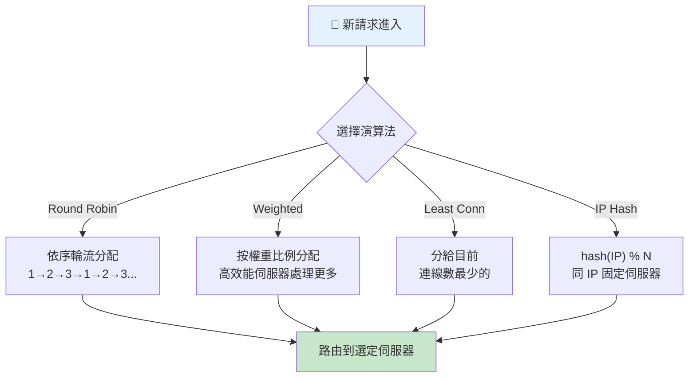

#### 執行 PoC

```bash
./scripts/01-load-balancing.sh
```

#### 驗證

```bash
# 從叢集內部測試負載平衡
kubectl run test-lb --rm -it --restart=Never -n poc-arch \
  --image=curlimages/curl:latest -- sh -c '
for i in 1 2 3 4 5 6; do
  echo "Request $i: $(curl -s http://echo-service/ | grep -o "HOSTNAME.*" | cut -d"\"" -f3)"
done'
```

**預期結果**：
```
Request 1: echo-server-xxx-abc
Request 2: echo-server-xxx-def    ← 不同的 Pod
Request 3: echo-server-xxx-ghi    ← 不同的 Pod
Request 4: echo-server-xxx-abc    ← 輪回第一個
...
```

#### 重點整理

| 概念 | 說明 |
|------|------|
| 水平擴展 | 增加更多伺服器來處理更多流量 |
| 垂直擴展 | 升級單一伺服器的硬體規格 |
| 高可用性 | 一台伺服器掛了，其他伺服器繼續服務 |

---

### 概念 2：快取 (Caching)

#### 什麼是快取？

每次查資料庫都要花 2 秒，太慢了！
**快取**就是把查過的資料暫存在記憶體中，下次直接從記憶體拿，只要 1 毫秒。

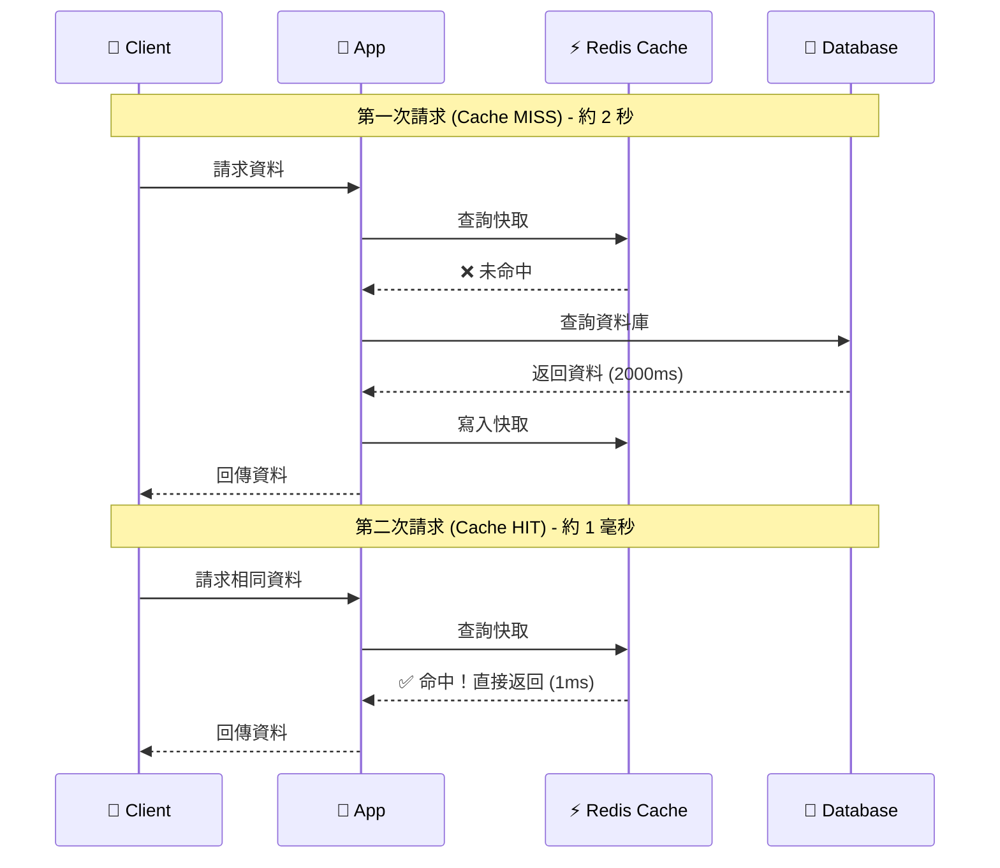

#### 快取策略比較

| 策略 | 說明 | 優點 | 缺點 |
|------|------|------|------|
| **Cache-Aside** | 應用程式自己管理快取 | 簡單直覺、容易實作 | 需要處理一致性 |
| **Write-Through** | 寫入時同時更新快取和 DB | 資料一致性高 | 寫入較慢 |
| **Write-Behind** | 先寫快取，異步寫 DB | 寫入超快 | 可能遺失資料 |
| **Read-Through** | 快取自動從 DB 載入 | 程式碼簡單 | 首次請求慢 |

#### 快取策略比較圖

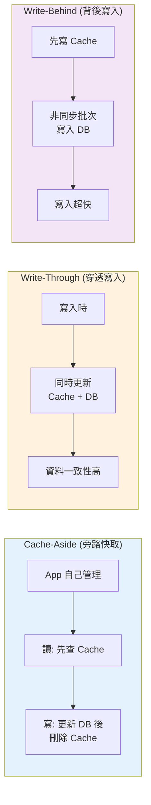

#### 快取常見問題

| 問題 | 說明 | 解決方案 |
|------|------|---------|
| **Cache Penetration** | 大量查詢不存在的資料，每次都打到 DB | 布隆過濾器、快取空值 |
| **Cache Breakdown** | 熱點資料過期瞬間，大量請求打到 DB | 加鎖、永不過期+異步更新 |
| **Cache Avalanche** | 大量資料同時過期 | 過期時間加隨機值 |

#### 執行 PoC

```bash
./scripts/02-caching.sh
```

#### 驗證

```bash
kubectl port-forward svc/cache-demo -n poc-arch 8081:80 &
sleep 2

# 第一次請求（快取未命中）
echo "=== 第一次請求 (Cache MISS) ==="
curl -s http://localhost:8081/product-123 | jq .

# 第二次請求（快取命中）
echo "=== 第二次請求 (Cache HIT) ==="
curl -s http://localhost:8081/product-123 | jq .

pkill -f "port-forward.*8081"
```

**預期結果**：
```json
// 第一次：約 2 秒
{
  "source": "DATABASE",
  "latency_ms": 2001.23
}

// 第二次：約 1 毫秒（快 4000 倍！）
{
  "source": "CACHE",
  "latency_ms": 0.45
}
```

---

### 概念 3：內容傳遞網路 (CDN)

#### 什麼是 CDN？

你的伺服器在台北，但用戶在紐約。每次載入圖片都要跨越太平洋，很慢！
**CDN** 把你的靜態檔案複製到全球各地的邊緣節點，用戶從最近的節點取得檔案。

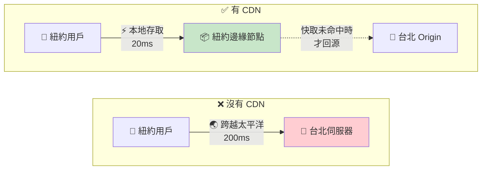

#### CDN 運作流程

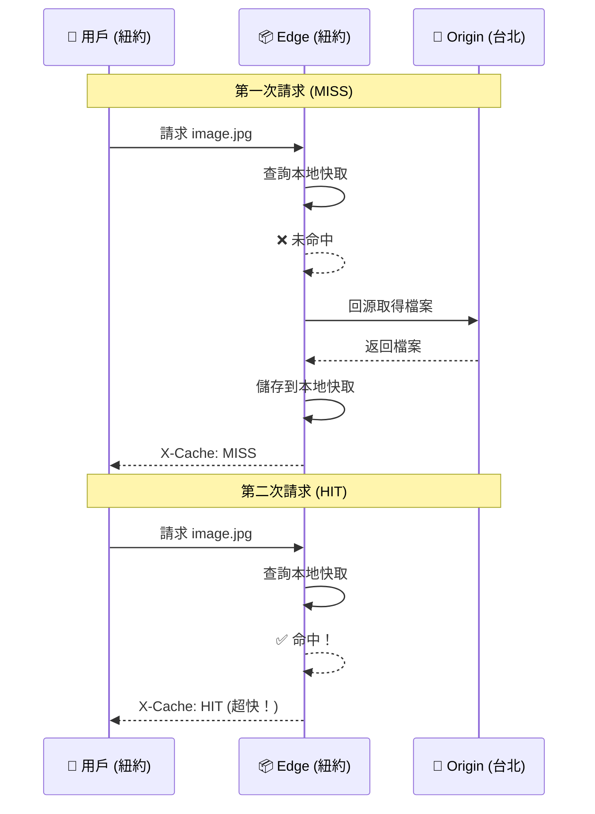

#### CDN 適合快取的內容

| 類型 | 範例 | 快取時間 |
|------|------|---------|
| 靜態檔案 | JS、CSS、圖片、字型 | 長期（1 年） |
| 媒體檔案 | 影片、音樂 | 長期 |
| API 回應 | 公開資料 | 短期（幾分鐘） |

#### 執行 PoC

```bash
./scripts/03-cdn.sh
```

#### 驗證

```bash
# 1. 先在 MinIO 建立測試檔案
kubectl exec -n poc-arch deployment/minio-origin -- sh -c '
echo "Hello CDN" > /tmp/test.txt && \
mc alias set local http://localhost:9000 minioadmin minioadmin && \
mc mb local/static --ignore-existing && \
mc cp /tmp/test.txt local/static/ && \
mc anonymous set download local/static'

# 2. 透過 CDN 邊緣存取
kubectl port-forward svc/cdn-edge -n poc-arch 8082:80 &
sleep 2

# 第一次（MISS - 從 Origin 取得）
curl -sI http://localhost:8082/static/test.txt | grep X-Cache

# 第二次（HIT - 從邊緣快取取得）
curl -sI http://localhost:8082/static/test.txt | grep X-Cache

pkill -f "port-forward.*8082"
```

**預期結果**：
```
X-Cache-Status: MISS    ← 第一次從 Origin 取得
X-Cache-Status: HIT     ← 第二次從邊緣快取取得
```

---

### 概念 4：訊息佇列 (Message Queue)

#### 什麼是訊息佇列？

想像一家餐廳：
- **沒有訊息佇列**：服務生等廚師做完一道菜才能接下一單（同步）
- **有訊息佇列**：服務生把訂單放到窗口，廚師依序處理（非同步）

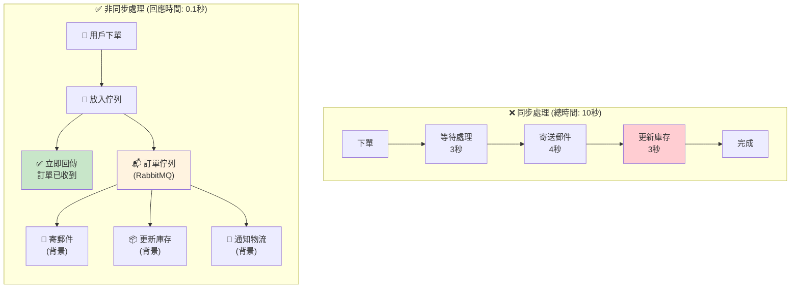

#### 訊息佇列競爭消費模式

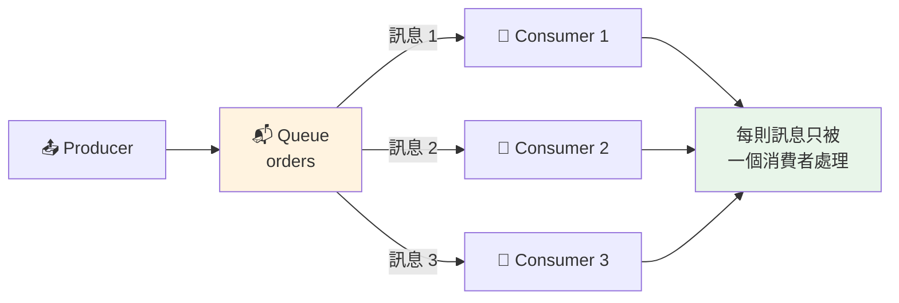

#### 訊息佇列 vs 發布/訂閱

| 特性 | 訊息佇列 (PoC 4) | 發布/訂閱 (PoC 5) |
|------|-----------------|-------------------|
| 訊息消費 | 一則訊息只被一個消費者處理 | 一則訊息被所有訂閱者處理 |
| 使用場景 | 任務分配、工作佇列 | 事件廣播、日誌收集 |
| 比喻 | 銀行叫號機 | 廣播電台 |
| 元件 | RabbitMQ | Kafka |

#### 執行 PoC

```bash
./scripts/04-message-queue.sh
```

#### 驗證

```bash
# 執行 Producer 發送 20 則訊息
kubectl run mq-producer --rm -it --restart=Never -n poc-arch \
  --image=python:3.11-slim \
  --overrides='{"spec":{"volumes":[{"name":"code","configMap":{"name":"mq-producer"}}],"containers":[{"name":"mq-producer","image":"python:3.11-slim","command":["sh","-c","pip install pika -q && python /app/producer.py"],"volumeMounts":[{"name":"code","mountPath":"/app"}]}]}}'

# 查看佇列狀態
kubectl exec -n poc-arch deployment/rabbitmq -- rabbitmqctl list_queues
```

**預期結果**：
```
[Producer] Sent: {'order_id': 'ORD-0001', ...}
[Producer] Sent: {'order_id': 'ORD-0002', ...}
...
[Producer] Done. 20 messages sent.

# 佇列狀態：0 則訊息（已被 3 個 Consumer 消費完畢）
orders	0
```

---

### 概念 5：發布/訂閱 (Publish-Subscribe)

#### 什麼是發布/訂閱？

想像一個廣播電台：
- 電台（Producer）播出節目
- 所有聽眾（Consumer Groups）都能同時收聽
- 每個聽眾群組都會收到完整的內容

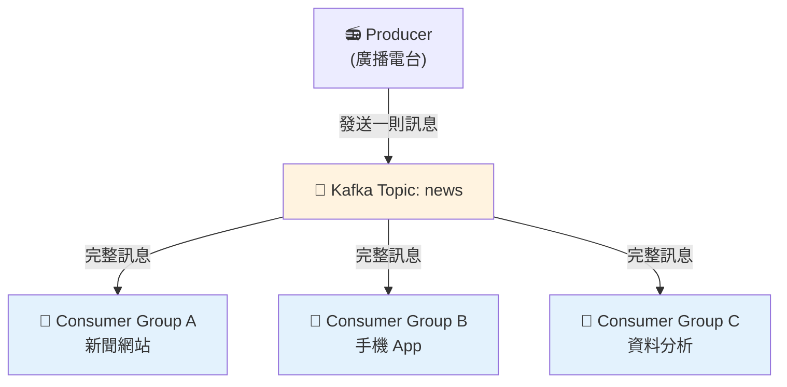

#### 訊息佇列 vs 發布/訂閱 對比圖

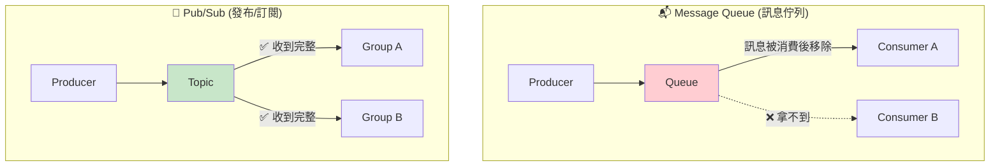

#### Kafka 核心概念

| 概念 | 說明 |
|------|------|
| **Topic** | 訊息的分類，類似資料夾 |
| **Partition** | Topic 的子分區，用於平行處理 |
| **Consumer Group** | 一群消費者共同消費一個 Topic |
| **Offset** | 消費者在 Partition 中的位置 |

#### 執行 PoC

```bash
./scripts/05-pub-sub.sh
```

**注意**：Kafka 需要 2-3 分鐘啟動，請等待 `kubectl get kafka -n poc-arch` 顯示 READY。

---

### 概念 6：API 閘道 (API Gateway)

#### 什麼是 API 閘道？

你有 10 個微服務，每個都有自己的 API。用戶端要記住 10 個不同的位址？太麻煩了！
**API 閘道**提供單一入口，統一處理路由、認證、限流。

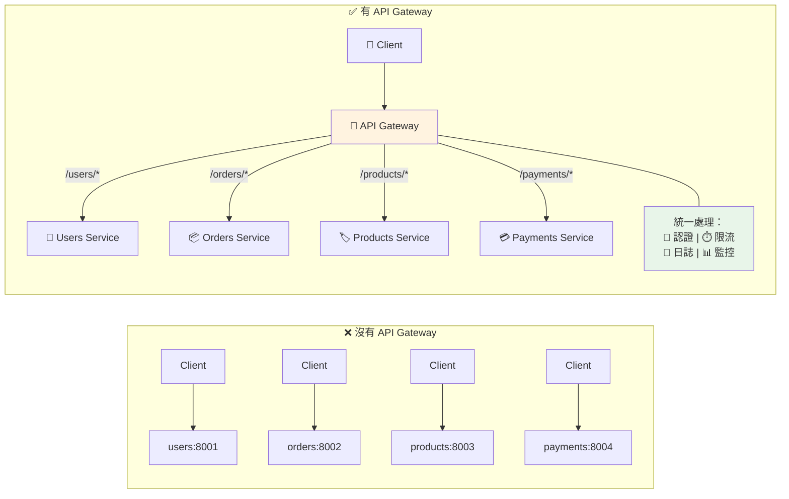

#### API Gateway 請求處理流程

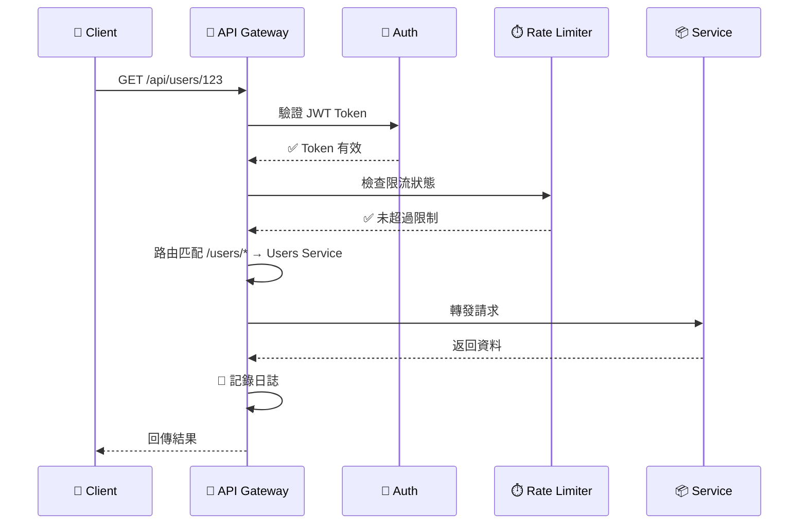

#### API 閘道功能

| 功能 | 說明 |
|------|------|
| **路由** | 根據 URL 轉發到對應的後端服務 |
| **認證** | 統一處理 JWT、API Key 驗證 |
| **限流** | 保護後端不被過多請求壓垮 |
| **監控** | 收集所有 API 的呼叫統計 |
| **轉換** | 修改請求/回應格式 |

#### 執行 PoC

```bash
./scripts/06-api-gateway.sh
```

---

### 概念 7：斷路器 (Circuit Breaker)

#### 什麼是斷路器？

你家的電路有保險絲。當電流過大時，保險絲會熔斷，保護整個電路。
**斷路器**模式也是如此：當下游服務故障時，自動「熔斷」，避免拖垮整個系統。

#### 狀態轉換圖

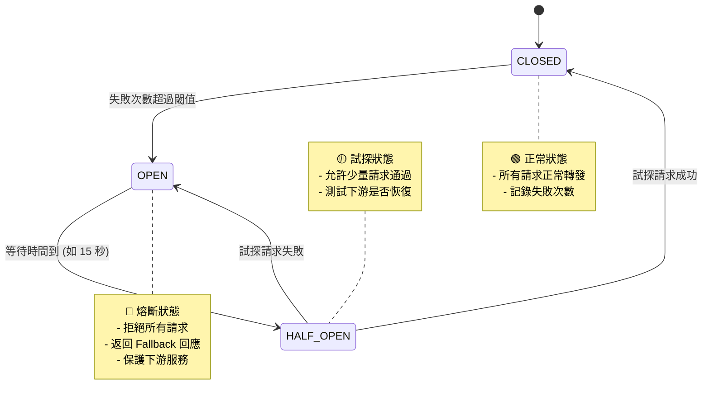

#### 斷路器運作時序圖

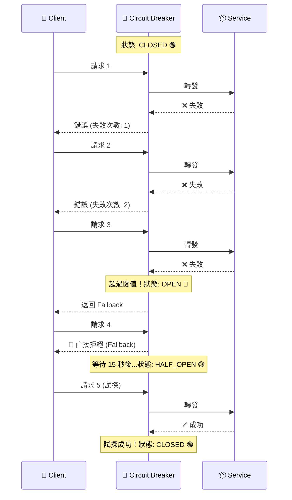

#### 四種實作版本比較

| 版本 | 語言 | 函式庫 | 適用場景 | 學習重點 |
|------|------|--------|---------|---------|
| 7a | Python | 自製 | 學習原理 | 狀態機實作 |
| 7b | Java | Resilience4j | Spring Boot 生產環境 | 註解驅動 |
| 7c | Java | Spring Cloud CB | 多雲環境 | 抽象層設計 |
| 7d | .NET | Polly v8 | .NET 生產環境 | Pipeline 模式 |

#### 執行 PoC

```bash
# Python 版（學習用）
./scripts/07-circuit-breaker.sh

# Java Resilience4j 版（生產等級）
./scripts/07b-circuit-breaker-java.sh
```

#### 驗證

```bash
kubectl port-forward svc/cb-demo -n poc-arch 8083:80 &
sleep 2

# 連續發送請求，觀察狀態變化
for i in $(seq 1 15); do
  echo "Request $i:"
  curl -s http://localhost:8083/ | jq '{state: .circuit_state, error: .error}'
  sleep 1
done

pkill -f "port-forward.*8083"
```

---

### 概念 8：服務發現 (Service Discovery)

#### 什麼是服務發現？

在微服務架構中，服務的 IP 可能隨時變化（Pod 重啟、擴縮容）。
**服務發現**讓服務可以用「名稱」而非「IP」來找到彼此。

```mermaid
flowchart LR
    subgraph hardcode["❌ 寫死 IP"]
        direction LR
        A1["Service A"] -->|"10.0.0.5:8080"| B1["Service B"]
        B1 -.->|"💥 IP 變更"| X["連線失敗!"]
    end

    subgraph discovery["✅ 服務發現"]
        direction LR
        A2["Service A"] -->|'service-b'"| DNS["🔍 DNS"]
        DNS -->|"解析"| IPS["10.0.0.5<br/>10.0.0.6<br/>10.0.0.7"]
        IPS --> B2["Service B<br/>(任一實例)"]
    end

    style X fill:#ffcdd2
    style DNS fill:#c8e6c9
```

#### Kubernetes 服務發現模型

```mermaid
flowchart TB
    subgraph ClusterIP["ClusterIP Service (預設)"]
        direction TB
        C1["Client"] -->|"service-b"| VIP["🎯 Virtual IP<br/>10.96.100.1"]
        VIP -->|"kube-proxy<br/>負載平衡"| P1A["Pod 1"]
        VIP -->|""| P1B["Pod 2"]
        VIP -->|""| P1C["Pod 3"]
    end

    subgraph Headless["Headless Service (clusterIP: None)"]
        direction TB
        C2["Client"] -->|"service-b"| DNS2["🔍 DNS 查詢"]
        DNS2 -->|"返回所有 Pod IP"| IPS2["10.244.1.1<br/>10.244.2.2<br/>10.244.3.3"]
        IPS2 -->|"Client 自行<br/>選擇連線"| P2A["Pod 1"]
    end

    style VIP fill:#e3f2fd
    style DNS2 fill:#fff3e0
```

#### Kubernetes 的兩種 Service 類型

| 類型 | DNS 回傳 | 適用場景 |
|------|----------|---------|
| **ClusterIP** | 單一虛擬 IP (VIP) | 一般服務，K8s 負責負載平衡 |
| **Headless** | 所有 Pod IP | 需要 Client 端負載平衡（如資料庫連線池） |

#### 執行 PoC

```bash
./scripts/08-service-discovery.sh
```

#### 驗證

```bash
kubectl run dns-test --rm -it --restart=Never -n poc-arch \
  --image=busybox:1.36 -- sh -c '
echo "=== ClusterIP Service (單一 VIP) ==="
nslookup provider-svc.poc-arch.svc.cluster.local

echo ""
echo "=== Headless Service (所有 Pod IP) ==="
nslookup provider-headless.poc-arch.svc.cluster.local'
```

**預期結果**：
```
=== ClusterIP Service (單一 VIP) ===
Address: 10.96.190.190      ← 單一虛擬 IP

=== Headless Service (所有 Pod IP) ===
Address: 10.244.1.12        ← Pod 1 的 IP
Address: 10.244.3.9         ← Pod 2 的 IP
Address: 10.244.2.13        ← Pod 3 的 IP
```

---

### 概念 9：分片 (Sharding)

#### 什麼是分片？

單一資料庫存不下 10 億筆資料？
**分片**把資料分散到多個資料庫，每個資料庫只存一部分。

```mermaid
flowchart TB
    subgraph before["❌ 分片前"]
        direction TB
        DB1["💾 單一資料庫<br/>10 億筆資料<br/>💥 超級慢！"]
    end

    subgraph after["✅ 分片後"]
        direction LR
        S1["💾 Shard 1<br/>用戶 1-33M"]
        S2["💾 Shard 2<br/>用戶 34-66M"]
        S3["💾 Shard 3<br/>用戶 67-100M"]
    end

    DB1 -.->|"水平切分"| S1
    DB1 -.->|""| S2
    DB1 -.->|""| S3

    style DB1 fill:#ffcdd2
    style S1 fill:#c8e6c9
    style S2 fill:#c8e6c9
    style S3 fill:#c8e6c9
```

#### 分片路由流程

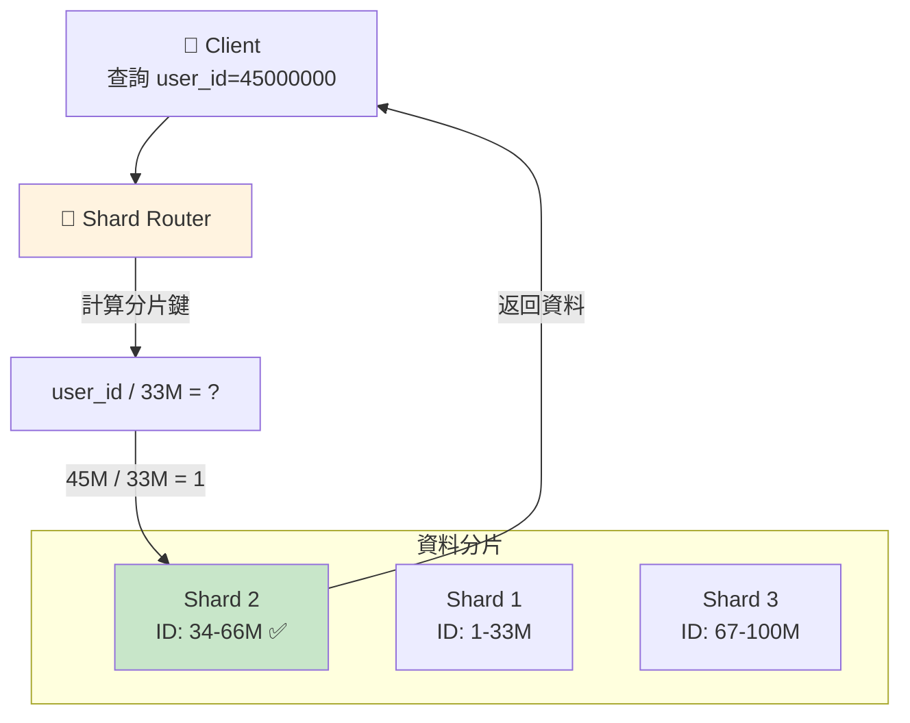

#### 分片策略

| 策略 | 說明 | 優點 | 缺點 |
|------|------|------|------|
| **Range-based** | 按範圍分（ID 1-1000 到 Shard 1） | 範圍查詢快 | 可能熱點不均 |
| **Hash-based** | 按 Hash 值分 | 分佈均勻 | 範圍查詢需掃描所有分片 |
| **Directory-based** | 用查找表決定 | 最靈活 | 需要額外維護目錄 |

#### 執行 PoC

```bash
./scripts/09-sharding.sh
```

---

### 概念 10：限流 (Rate Limiting)

#### 什麼是限流？

API 被惡意攻擊或爬蟲大量請求怎麼辦？
**限流**限制每個用戶每秒只能發送固定數量的請求。

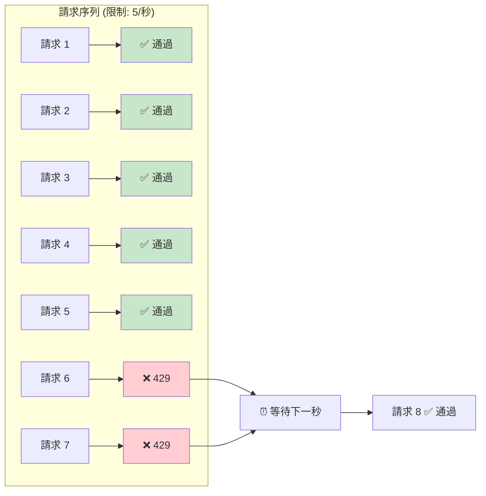

#### 常見限流演算法比較

```mermaid
flowchart LR
    subgraph TB["Token Bucket (令牌桶)"]
        direction TB
        TK1["🪣 桶容量: 10"]
        TK2["⏱️ 每秒補充 5 個"]
        TK3["📨 請求取走 1 個令牌"]
        TK4["✅ 允許突發流量"]
    end

    subgraph LB["Leaky Bucket (漏桶)"]
        direction TB
        LK1["🪣 桶容量: 10"]
        LK2["💧 固定速率流出"]
        LK3["📨 請求進入桶中"]
        LK4["📊 輸出速率恆定"]
    end

    subgraph FW["Fixed Window (固定窗口)"]
        direction TB
        FW1["⏰ 每秒重置計數"]
        FW2["📊 計數 ≤ 5 通過"]
        FW3["⚠️ 窗口邊界突發"]
    end

    style TB fill:#e3f2fd
    style LB fill:#fff3e0
    style FW fill:#f3e5f5
```

#### 限流演算法

| 演算法 | 說明 | 優點 | 缺點 |
|--------|------|------|------|
| **Fixed Window** | 固定時間窗口計數 | 實作簡單 | 窗口邊界可能突發 |
| **Sliding Window** | 滑動窗口計數 | 更平滑 | 記憶體較多 |
| **Token Bucket** | 令牌桶 | 允許突發 | 實作稍複雜 |
| **Leaky Bucket** | 漏桶 | 輸出平穩 | 不允許突發 |

#### 執行 PoC

```bash
./scripts/10-rate-limiting.sh
```

---

### 概念 11：一致性雜湊 (Consistent Hashing)

#### 什麼是一致性雜湊？

傳統 Hash：`server = hash(key) % server_count`
問題：當 server_count 變化時，幾乎所有 key 都要重新分配！

**一致性雜湊**把伺服器和 key 都映射到一個環上，只有相鄰的 key 需要重新分配。

```mermaid
flowchart LR
    subgraph traditional["❌ 傳統 Hash"]
        direction TB
        T1["原本 3 台伺服器<br/>hash(key) % 3"]
        T2["新增 1 台變 4 台<br/>hash(key) % 4"]
        T3["💥 ~75% key 重新分配！"]
        T1 --> T2 --> T3
    end

    subgraph consistent["✅ 一致性 Hash"]
        direction TB
        C1["新增 1 台伺服器"]
        C2["只影響相鄰區間"]
        C3["📊 ~25% key 重新分配"]
        C1 --> C2 --> C3
    end

    style T3 fill:#ffcdd2
    style C3 fill:#c8e6c9
```

#### 一致性雜湊環視覺化

```mermaid
flowchart TB
    subgraph ring["🔵 Hash Ring (雜湊環)"]
        direction TB

        N0["0°"] --- NA["🖥️ Node A<br/>(位置: 60°)"]
        NA --- N90["90°"]
        N90 --- NB["🖥️ Node B<br/>(位置: 180°)"]
        NB --- N180["180°"]
        N180 --- NC["🖥️ Node C<br/>(位置: 270°)"]
        NC --- N270["270°"]
        N270 --- N0
    end

    subgraph keys["🔑 Key 分配"]
        K1["key1 (hash=45°)<br/>→ Node A ✅"]
        K2["key2 (hash=120°)<br/>→ Node B ✅"]
        K3["key3 (hash=200°)<br/>→ Node C ✅"]
    end

    subgraph rule["📋 分配規則"]
        R["順時針找到<br/>最近的節點"]
    end

    style NA fill:#e3f2fd
    style NB fill:#fff3e0
    style NC fill:#f3e5f5
```

#### 新增節點時的影響

```mermaid
flowchart LR
    subgraph before["新增前"]
        direction TB
        B_A["Node A"] -->|"管理"| B_K["key1, key2, key3"]
    end

    subgraph after["新增 Node D 後"]
        direction TB
        A_A["Node A"] -->|"管理"| A_K1["key1, key3"]
        A_D["Node D 🆕"] -->|"接管"| A_K2["key2"]
    end

    before -->|"只有 key2<br/>需要搬移"| after

    style A_D fill:#c8e6c9
```

#### 執行 PoC

```bash
./scripts/11-consistent-hashing.sh
```

---

### 概念 12：自動擴縮 (Auto Scaling)

#### 什麼是自動擴縮？

流量高峰時手動增加伺服器？太慢了！
**自動擴縮**根據 CPU、記憶體等指標，自動增減伺服器數量。

```mermaid
flowchart TB
    HPA["🎛️ HPA Controller<br/>監控 CPU 使用率"]

    HPA --> CHECK{"CPU 使用率?"}

    CHECK -->|"< 30%"| DOWN["📉 縮減 Pod<br/>節省資源"]
    CHECK -->|"30-70%"| KEEP["📊 維持現狀"]
    CHECK -->|"> 70%"| UP["📈 增加 Pod<br/>應對負載"]

    DOWN --> PODS1["1 Pod"]
    KEEP --> PODS2["3 Pods"]
    UP --> PODS3["8 Pods"]

    style DOWN fill:#e3f2fd
    style UP fill:#ffcdd2
    style HPA fill:#fff3e0
```

#### 自動擴縮時間軸範例

```mermaid
gantt
    title 自動擴縮 - 一天的 Pod 數量變化
    dateFormat HH:mm
    axisFormat %H:%M

    section Pod 數量
    1 Pod (深夜低負載)     :done, 00:00, 09:00
    3 Pods (流量上升)      :active, 09:00, 11:00
    8 Pods (午休高峰)      :crit, 11:00, 14:00
    5 Pods (下午)          :active, 14:00, 18:00
    3 Pods (晚間)          :done, 18:00, 22:00
    1 Pod (深夜)           :done, 22:00, 24:00
```

#### HPA 決策流程

```mermaid
sequenceDiagram
    participant M as 📊 Metrics Server
    participant H as 🎛️ HPA Controller
    participant D as 📦 Deployment
    participant P as 🏃 Pods

    loop 每 15 秒
        M->>H: 回報 CPU 使用率: 85%
        H->>H: 計算: 85% > 目標 50%
        H->>H: 需要 Pod 數: ceil(3 * 85/50) = 6
        H->>D: 調整 replicas: 3 → 6
        D->>P: 啟動 3 個新 Pod
        P-->>H: 新 Pod 就緒
        Note over H,P: CPU 下降到 50%
    end
```

#### HPA 設定參數

| 參數 | 說明 |
|------|------|
| `minReplicas` | 最小 Pod 數量 |
| `maxReplicas` | 最大 Pod 數量 |
| `targetCPUUtilization` | 目標 CPU 使用率 |
| `scaleUpStabilization` | 擴展前等待時間（避免頻繁擴縮） |
| `scaleDownStabilization` | 縮減前等待時間 |

#### 執行 PoC

```bash
./scripts/12-auto-scaling.sh
```

#### 驗證

```bash
# Terminal 1: 監控 HPA
kubectl get hpa -n poc-arch -w

# Terminal 2: 監控 Pod 數量
watch -n 2 'kubectl get pods -l app=autoscale-app -n poc-arch'

# Terminal 3: 產生負載
kubectl run load-gen --rm -it --restart=Never -n poc-arch \
  --image=busybox:1.36 -- /bin/sh -c \
  'while true; do wget -q -O- http://autoscale-app/ > /dev/null; done'
```

---

## 學習路徑建議

### 初學者路線（4 週）

```mermaid
flowchart TB
    subgraph W1["📅 Week 1: 基礎概念"]
        direction LR
        W1A["Day 1-2<br/>⓪ 叢集建置<br/>① 負載平衡"] --> W1B["Day 3-4<br/>② 快取<br/>⑧ 服務發現"] --> W1C["Day 5-7<br/>⑫ 自動擴縮"]
    end

    subgraph W2["📅 Week 2: 非同步處理"]
        direction LR
        W2A["Day 1-3<br/>④ 訊息佇列"] --> W2B["Day 4-7<br/>⑤ 發布/訂閱"]
    end

    subgraph W3["📅 Week 3: 韌性設計"]
        direction LR
        W3A["Day 1-3<br/>⑦ 斷路器"] --> W3B["Day 4-5<br/>⑩ 限流"] --> W3C["Day 6-7<br/>③ CDN"]
    end

    subgraph W4["📅 Week 4: 進階主題"]
        direction LR
        W4A["Day 1-2<br/>⑥ API 閘道"] --> W4B["Day 3-4<br/>⑨ 分片"] --> W4C["Day 5-7<br/>⑪ 一致性雜湊"]
    end

    W1 --> W2 --> W3 --> W4

    style W1 fill:#e3f2fd
    style W2 fill:#fff3e0
    style W3 fill:#f3e5f5
    style W4 fill:#e8f5e9
```

### 準備面試路線

重點掌握這些概念，面試最常問：

| 優先級 | 概念 | 面試常見問題 |
|--------|------|-------------|
| ⭐⭐⭐ | 負載平衡 | 演算法比較、Session 處理 |
| ⭐⭐⭐ | 快取 | Cache invalidation、一致性問題 |
| ⭐⭐⭐ | 訊息佇列 vs Pub/Sub | 何時使用、差異比較 |
| ⭐⭐⭐ | 斷路器 | 雪崩效應、Fallback 策略 |
| ⭐⭐⭐ | 分片 + 一致性雜湊 | 資料庫擴展、熱點問題 |
| ⭐⭐ | API 閘道 | 微服務架構、認證授權 |
| ⭐⭐ | 自動擴縮 | 指標選擇、擴縮策略 |

---

## 常見問題排解

### Q1: Pod 一直處於 Pending 狀態

```bash
kubectl describe pod <pod-name> -n poc-arch
```

常見原因：
- 資源不足（記憶體、CPU）→ 增加 Docker 資源限制
- PVC 綁定失敗 → 檢查 StorageClass
- 節點 Taint 不匹配 → 檢查 tolerations

### Q2: hashicorp/http-echo 映像檔無法啟動

這個映像檔在新版 Linux 核心上有相容性問題。解決方法：
```bash
# 改用 ealen/echo-server
kubectl set image deployment/xxx xxx=ealen/echo-server:latest -n poc-arch
```

### Q3: Kafka 啟動很慢

Kafka 需要 2-3 分鐘才能完全啟動。檢查狀態：
```bash
kubectl get kafka -n poc-arch
kubectl get pods -n poc-arch | grep kafka
```

### Q4: metrics-server 顯示 `<unknown>`

```bash
kubectl top nodes  # 如果報錯，metrics-server 尚未就緒
kubectl logs -n kube-system -l k8s-app=metrics-server
```

### Q5: 無法連線到叢集

```bash
kubectl config current-context  # 確認是 kind-arch-poc
kubectl cluster-info           # 檢查叢集狀態
docker ps | grep kindest       # 確認 Kind 容器運行中
```

---

## 延伸學習資源

### 推薦書籍

| 書名 | 作者 | 重點 |
|------|------|------|
| 《Designing Data-Intensive Applications》 | Martin Kleppmann | 資料系統設計聖經 |
| 《System Design Interview》 | Alex Xu | 面試導向系統設計 |
| 《Building Microservices》 | Sam Newman | 微服務架構實務 |

### 線上課程

- [ByteByteGo System Design](https://bytebytego.com/) - 圖解系統設計
- [Grokking the System Design Interview](https://www.educative.io/) - 面試準備

### 官方文件

- [Kubernetes Documentation](https://kubernetes.io/docs/)
- [Redis Documentation](https://redis.io/documentation)
- [Apache Kafka Documentation](https://kafka.apache.org/documentation/)
- [RabbitMQ Tutorials](https://www.rabbitmq.com/getstarted.html)

### 實用工具

| 工具 | 用途 |
|------|------|
| [k9s](https://k9scli.io/) | Kubernetes CLI 圖形介面 |
| [Lens](https://k8slens.dev/) | Kubernetes IDE |
| [Postman](https://www.postman.com/) | API 測試 |
| [Wireshark](https://www.wireshark.org/) | 網路封包分析 |

---

## 貢獻指南

歡迎提交 Issue 或 Pull Request！

1. Fork 本專案
2. 建立功能分支 (`git checkout -b feature/amazing-feature`)
3. 提交變更 (`git commit -m '新增 amazing 功能'`)
4. 推送到分支 (`git push origin feature/amazing-feature`)
5. 開啟 Pull Request

---

## 授權

MIT License
